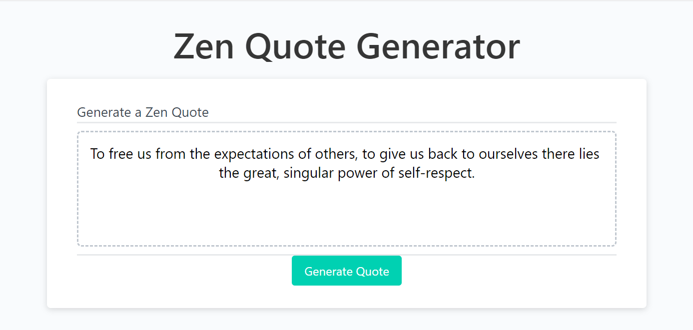
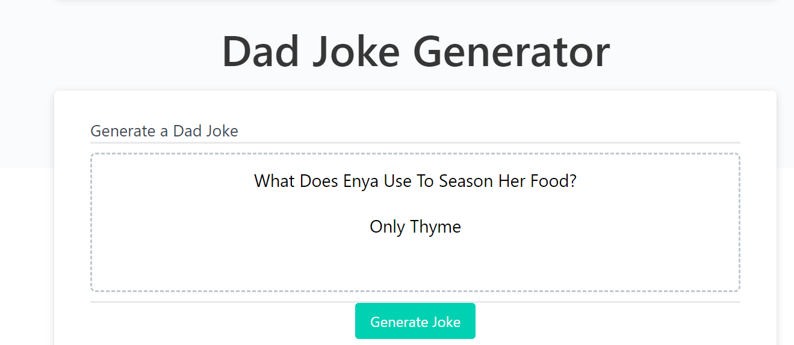

# FeelGood App

## Authors

Devin Nunez & Owen Warner

Email: devv-nunn@gmail.com
        warnerowen11@gmail.com

git: https://github.com/devv-nunn
        https://github.com/owenwar

## Description

In this project we will focus on the mental health of users by randomly generating a random quote and a random joke. This application focus's on API calls and data traversal and local storage to save these jokes for later use of the application.

-In this project we learned the implementation of local storage for data storage and traversing through JSON data. This JSON data was retrieved by api calls. 

## Table of Contents
N/a

## Installation

- Nothing needed be installed other than vs code to run application.

- Clone the following repository and run index.html.

## Usage

To use this feel good application just clone the repository, run the application in local host. Once in the feel good webpage just one of the two buttons to fill the designated area with a joke and/or a quote.

local storage will store these quotes for later retrieval on page reset and will be updated to last generated joke and quote.

## Deployment

Repo: https://github.com/devv-nunn/grandpaLou

GitPage: https://devv-nunn.github.io/grandpaLou/

# Tech Stack

- HTML 
- CSS
- JavaScript
- JQuery
- Bulma framework

## Credits

N/a

## License

MIT License.